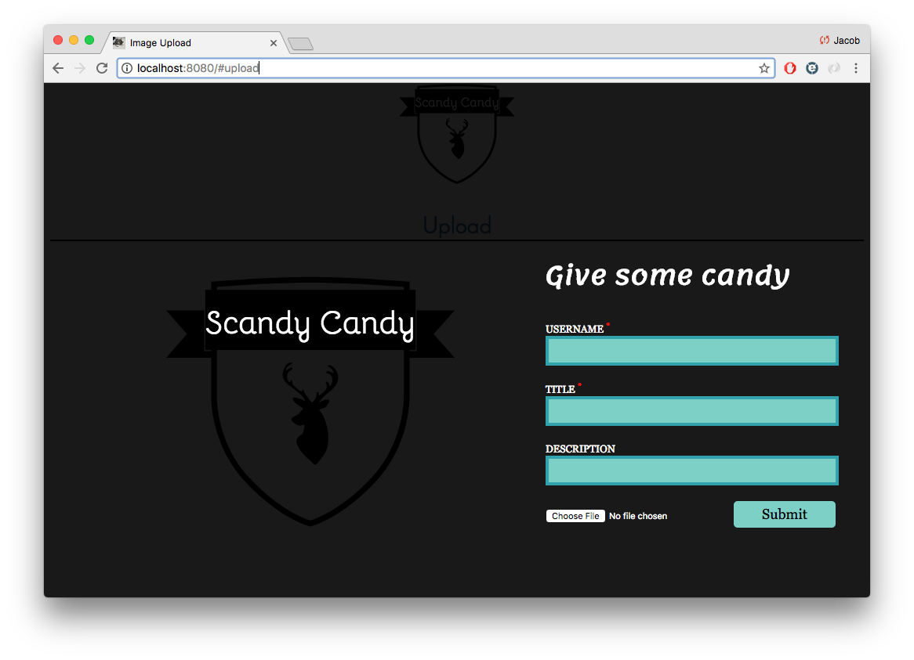

# Image board Project

## Overview

This application is a full stack project where users can upload and share an image of their favorite Scandinavians.

## Technology

-- Image board application built with Backbone and Express --
 - Utilized Backbone, Node, Express, HTML/CSS, JavaScript, PostgresSQL, and jQuery.
 - Application allows users to upload a photo using Amazon S3.
 - When viewing images, users can comment and see all other comments.

This website brings users to an upload page where they can share an image. The user can create their username, title, and description of the image.

Users can go right to the main image board page by clicking on the main icon. This takes the user to the main page where users can see the other images that have been uploaded. The user can then click on any image to see a larger version and comment on the image.

